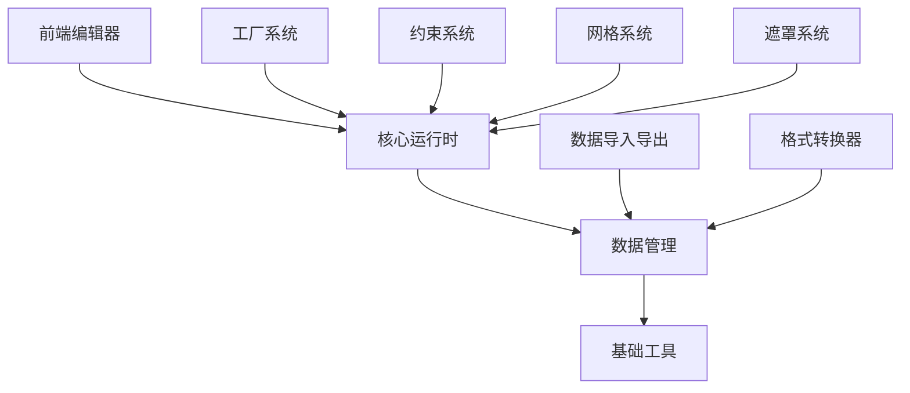

# 骨骼动画系统设计文档

## 1. 系统架构设计

### 1.1 整体架构

```
┌─────────────────────────────────────────────────────────┐
│                  前端编辑器层                           │
│  (Web Editor + UI Components + Canvas Rendering)       │
├─────────────────────────────────────────────────────────┤
│                  核心运行时层                           │
│  (Skeleton Engine + Animation System + Constraints)    │
├─────────────────────────────────────────────────────────┤
│                  数据管理层                             │
│  (Data Models + Parsers + Serialization)               │
├─────────────────────────────────────────────────────────┤
│                  基础工具层                             │
│  (Geometry + Events + Memory Management)               │
└─────────────────────────────────────────────────────────┘
```

### 1.2 代码目录结构（隔离性设计）

```
# Java 后端代码 - 完全独立目录
src/main/java/com/example/writemyself/skeleton/
├── core/                           # 核心引擎
│   ├── data/                      # 数据模型
│   ├── object/                    # 基础对象
│   ├── bone/                      # 骨骼系统
│   ├── animation/                 # 动画系统
│   ├── constraint/                # 约束系统
│   └── mesh/                      # 网格系统
├── editor/                        # Web编辑器后端
│   ├── controller/                # 控制器
│   ├── service/                   # 服务层
│   └── repository/                # 数据访问
├── formats/                       # 数据格式
│   ├── parser/                    # 数据解析器
│   └── exporter/                  # 数据导出器
└── examples/                      # 示例代码

# 前端资源 - 完全独立目录
src/main/resources/static/js/skeleton/
├── core/                          # 核心引擎
├── editor/                        # Web编辑器
├── formats/                       # 数据格式
└── examples/                      # 示例代码

# 配置文件 - 独立配置
src/main/resources/skeleton/
├── config/                        # 配置文件
└── templates/                     # 模板文件
```

**重要：此目录结构与现有 character-frame-sequence 功能完全隔离，确保不影响现有功能**

### 1.3 模块依赖关系

### 1.2 模块依赖关系



## 2. 核心数据结构设计

### 2.1 基础几何类型

```typescript
// Point.ts - 点坐标
export class Point {
    public x: number = 0;
    public y: number = 0;

    constructor(x: number = 0, y: number = 0) {
        this.x = x;
        this.y = y;
    }

    public copyFrom(point: Point): Point {
        this.x = point.x;
        this.y = point.y;
        return this;
    }

    public clear(): Point {
        this.x = 0;
        this.y = 0;
        return this;
    }
}

// Matrix.ts - 变换矩阵
export class Matrix {
    public a: number = 1;
    public b: number = 0;
    public c: number = 0;
    public d: number = 1;
    public tx: number = 0;
    public ty: number = 0;

    constructor(a: number = 1, b: number = 0, c: number = 0, d: number = 1, tx: number = 0, ty: number = 0) {
        this.a = a;
        this.b = b;
        this.c = c;
        this.d = d;
        this.tx = tx;
        this.ty = ty;
    }

    public copyFrom(matrix: Matrix): Matrix {
        this.a = matrix.a;
        this.b = matrix.b;
        this.c = matrix.c;
        this.d = matrix.d;
        this.tx = matrix.tx;
        this.ty = matrix.ty;
        return this;
    }

    public concat(matrix: Matrix): Matrix {
        const a: number = this.a * matrix.a + this.b * matrix.c;
        const b: number = this.a * matrix.b + this.b * matrix.d;
        const c: number = this.c * matrix.a + this.d * matrix.c;
        const d: number = this.c * matrix.b + this.d * matrix.d;
        const tx: number = this.tx * matrix.a + this.ty * matrix.c + matrix.tx;
        const ty: number = this.tx * matrix.b + this.ty * matrix.d + matrix.ty;

        this.a = a;
        this.b = b;
        this.c = c;
        this.d = d;
        this.tx = tx;
        this.ty = ty;
        return this;
    }

    public transformPoint(point: Point): Point {
        const x: number = point.x;
        const y: number = point.y;
        point.x = this.a * x + this.c * y + this.tx;
        point.y = this.b * x + this.d * y + this.ty;
        return point;
    }
}

// Transform.ts - 变换信息
export class Transform {
    public x: number = 0;
    public y: number = 0;
    public skewX: number = 0;
    public skewY: number = 0;
    public scaleX: number = 1;
    public scaleY: number = 1;

    public readonly matrix: Matrix = new Matrix();

    constructor() {}

    public toMatrix(): Matrix {
        const matrix = this.matrix;
        matrix.a = this.scaleX * Math.cos(this.skewY);
        matrix.b = this.scaleX * Math.sin(this.skewY);
        matrix.c = -this.scaleY * Math.sin(this.skewX);
        matrix.d = this.scaleY * Math.cos(this.skewX);
        matrix.tx = this.x;
        matrix.ty = this.y;
        return matrix;
    }

    public copyFrom(transform: Transform): Transform {
        this.x = transform.x;
        this.y = transform.y;
        this.skewX = transform.skewX;
        this.skewY = transform.skewY;
        this.scaleX = transform.scaleX;
        this.scaleY = transform.scaleY;
        return this;
    }
}
```

### 2.2 骨骼数据结构

```typescript
// BoneData.ts - 骨骼数据
export class BoneData extends BaseObject {
    public name: string;
    public parent: string = "";
    public length: number = 0;
    public transform: Transform = new Transform();
    public userData: any = null;

    constructor(name: string = "") {
        super();
        this.name = name;
    }

    protected _reset(): void {
        this.name = "";
        this.parent = "";
        this.length = 0;
        this.transform = new Transform();
        this.userData = null;
    }
}

// ArmatureData.ts - 骨架数据
export class ArmatureData extends BaseObject {
    public name: string;
    public readonly bones: Map<string, BoneData> = new Map();
    public readonly slots: Map<string, SlotData> = new Map();
    public readonly animations: Map<string, AnimationData> = new Map();
    public readonly skins: Map<string, SkinData> = new Map();
    public frameRate: number = 24;

    constructor(name: string = "") {
        super();
        this.name = name;
    }

    public addBoneData(boneData: BoneData): void {
        if (boneData.name && !this.bones.has(boneData.name)) {
            this.bones.set(boneData.name, boneData);
        }
    }

    public addSlotData(slotData: SlotData): void {
        if (slotData.name && !this.slots.has(slotData.name)) {
            this.slots.set(slotData.name, slotData);
        }
    }

    public addAnimationData(animationData: AnimationData): void {
        if (animationData.name && !this.animations.has(animationData.name)) {
            this.animations.set(animationData.name, animationData);
        }
    }

    protected _reset(): void {
        this.name = "";
        this.bones.clear();
        this.slots.clear();
        this.animations.clear();
        this.skins.clear();
        this.frameRate = 24;
    }
}
```

### 2.3 动画数据结构

```typescript
// AnimationData.ts - 动画数据
export class AnimationData extends BaseObject {
    public name: string;
    public frameRate: number = 24;
    public duration: number = 0;  // 动画持续时间（帧）
    public playTimes: number = 1; // 播放次数，-1表示无限循环
    public fadeInTime: number = 0; // 淡入时间

    public readonly boneTimelines: Map<string, BoneTimelineData> = new Map();
    public readonly slotTimelines: Map<string, SlotTimelineData> = new Map();
    public readonly constraintTimelines: Map<string, ConstraintTimelineData> = new Map();
    public readonly frameEvents: Array<EventData> = [];

    constructor(name: string = "") {
        super();
        this.name = name;
    }

    protected _reset(): void {
        this.name = "";
        this.frameRate = 24;
        this.duration = 0;
        this.playTimes = 1;
        this.fadeInTime = 0;
        this.boneTimelines.clear();
        this.slotTimelines.clear();
        this.constraintTimelines.clear();
        this.frameEvents.length = 0;
    }
}

// TimelineData.ts - 时间轴数据
export abstract class TimelineData extends BaseObject {
    public type: TimelineType;
    public readonly frames: Array<FrameData> = [];

    constructor(type: TimelineType) {
        super();
        this.type = type;
    }

    public addFrame(frameData: FrameData): void {
        this.frames.push(frameData);
        this.frames.sort((a, b) => a.position - b.position);
    }

    protected _reset(): void {
        this.type = TimelineType.None;
        this.frames.length = 0;
    }
}

export class BoneTimelineData extends TimelineData {
    public boneName: string;
    public readonly translateFrames: Array<TranslateFrameData> = [];
    public readonly rotateFrames: Array<RotateFrameData> = [];
    public readonly scaleFrames: Array<ScaleFrameData> = [];

    constructor(boneName: string) {
        super(TimelineType.Bone);
        this.boneName = boneName;
    }
}
```

## 3. 核心运行时设计

### 3.1 基础对象和对象池

```typescript
// BaseObject.ts - 基础对象类
export abstract class BaseObject {
    private static _pool: Map<Constructor, Array<BaseObject>> = new Map();

    public static borrowObject<T extends BaseObject>(constructor: Constructor<T>): T {
        const pool = this._pool.get(constructor);
        if (pool && pool.length > 0) {
            return pool.pop() as T;
        }
        return new constructor();
    }

    public static returnObject(object: BaseObject): void {
        object._reset();
        const pool = this._pool.get(object.constructor);
        if (!pool) {
            this._pool.set(object.constructor, [object]);
        } else {
            pool.push(object);
        }
    }

    protected abstract _reset(): void;

    public returnToPool(): void {
        BaseObject.returnObject(this);
    }
}

// 类型定义
type Constructor<T = any> = new (...args: any[]) => T;

// EventObject.ts - 事件对象
export class EventObject extends BaseObject {
    public static readonly START: string = "start";
    public static readonly END: string = "end";
    public static readonly COMPLETE: string = "complete";
    public static readonly LOOP_COMPLETE: string = "loopComplete";
    public static readonly SOUND_EVENT: string = "soundEvent";

    public type: string;
    public armature: Armature;
    public bone: Bone | null = null;
    public slot: Slot | null = null;
    public data: any = null;

    protected _reset(): void {
        this.type = "";
        this.armature = null as any;
        this.bone = null;
        this.slot = null;
        this.data = null;
    }
}
```

### 3.2 骨骼系统实现

```typescript
// TransformObject.ts - 变换对象基类
export abstract class TransformObject extends BaseObject {
    public readonly global: Transform = new Transform();
    public readonly offset: Transform = new Transform();
    public readonly worldTransform: Matrix = new Matrix();

    public _transformDirty: boolean = false;
    public _parent: TransformObject | null = null;

    public updateTransform(): void {
        if (this._transformDirty) {
            this.global.toMatrix();
            this._transformDirty = false;
        }

        if (this._parent) {
            this.worldTransform.copyFrom(this._parent.worldTransform);
            this.worldTransform.concat(this.global.matrix);
        } else {
            this.worldTransform.copyFrom(this.global.matrix);
        }
    }

    protected _reset(): void {
        this.global.clear();
        this.offset.clear();
        this.worldTransform.identity();
        this._transformDirty = false;
        this._parent = null;
    }
}

// Bone.ts - 骨骼类
export class Bone extends TransformObject {
    public readonly boneData: BoneData;
    public readonly children: Array<Bone> = [];
    public readonly animationPose: Transform = new Transform();

    public _childrenTransformDirty: boolean = false;
    public _hasConstraint: boolean = false;

    constructor(boneData: BoneData) {
        super();
        this.boneData = boneData;
    }

    public update(dirty: boolean = false): void {
        const transformDirty = this._transformDirty || dirty;

        if (transformDirty) {
            this.updateTransform();
            this._childrenTransformDirty = true;
        }

        if (this._hasConstraint) {
            this.updateConstraints();
        }

        for (const child of this.children) {
            child.update(this._childrenTransformDirty);
        }

        this._childrenTransformDirty = false;
        this._transformDirty = false;
    }

    public updateConstraints(): void {
        // 约束求解逻辑将在约束系统中实现
    }

    public addChild(child: Bone): void {
        if (child._parent) {
            child._parent.removeChild(child);
        }

        child._parent = this;
        this.children.push(child);
    }

    public removeChild(child: Bone): void {
        const index = this.children.indexOf(child);
        if (index >= 0) {
            this.children.splice(index, 1);
            child._parent = null;
        }
    }

    protected _reset(): void {
        super._reset();
        this.children.length = 0;
        this.animationPose.clear();
        this._childrenTransformDirty = false;
        this._hasConstraint = false;
    }
}
```

### 3.3 骨架系统实现

```typescript
// Armature.ts - 骨架类
export class Armature extends TransformObject implements IEventDispatcher {
    public readonly armatureData: ArmatureData;
    public readonly bones: Map<string, Bone> = new Map();
    public readonly slots: Map<string, Slot> = new Map();
    public readonly constraints: Map<string, Constraint> = new Map();

    public animation: Animation;
    public eventDispatcher: IEventDispatcher;
    public clock: WorldClock | null = null;

    private _display: any = null;
    private _replacedTextureAtlasData: TextureAtlasData | null = null;

    constructor(armatureData: ArmatureData, eventDispatcher: IEventDispatcher, display: any) {
        super();
        this.armatureData = armatureData;
        this.eventDispatcher = eventDispatcher;
        this._display = display;

        this.animation = new Animation(this);
        this._buildBones();
        this._buildSlots();
        this._buildConstraints();
    }

    private _buildBones(): void {
        for (const boneData of this.armatureData.bones.values()) {
            const bone = new Bone(boneData);
            this.bones.set(boneData.name, bone);
        }

        // 建立骨骼层级关系
        for (const boneData of this.armatureData.bones.values()) {
            if (boneData.parent) {
                const parent = this.bones.get(boneData.parent);
                const child = this.bones.get(boneData.name);
                if (parent && child) {
                    parent.addChild(child);
                }
            }
        }
    }

    private _buildSlots(): void {
        for (const slotData of this.armatureData.slots.values()) {
            const bone = this.bones.get(slotData.parent);
            if (bone) {
                const slot = new Slot(slotData, this, bone);
                this.slots.set(slotData.name, slot);
            }
        }
    }

    public advanceTime(passedTime: number): void {
        if (this.clock) {
            this.clock.advanceTime(passedTime);
        }
    }

    public dispose(): void {
        if (this.animation) {
            this.animation.dispose();
        }

        for (const bone of this.bones.values()) {
            bone.returnToPool();
        }

        for (const slot of this.slots.values()) {
            slot.returnToPool();
        }

        this.bones.clear();
        this.slots.clear();
        this.constraints.clear();
    }

    protected _reset(): void {
        super._reset();
        this.bones.clear();
        this.slots.clear();
        this.constraints.clear();
        this._display = null;
        this._replacedTextureAtlasData = null;
    }

    // IEventDispatcher 接口实现
    public dispatchDBEvent(type: string, data: any): void {
        this.eventDispatcher.dispatchDBEvent(type, data);
    }

    public hasDBEvent(type: string): boolean {
        return this.eventDispatcher.hasDBEvent(type);
    }
}
```

## 4. 动画系统实现

### 4.1 动画状态机

```typescript
// AnimationState.ts - 动画状态
export class AnimationState extends BaseObject {
    public readonly name: string;
    public readonly armature: Armature;

    public timeScale: number = 1.0;
    public playTimes: number = -1;  // -1 表示无限循环
    public autoFadeOut: boolean = true;
    public fadeOutTime: number = 0.3;

    private _animationData: AnimationData;
    private _currentTime: number = 0;
    private _totalTime: number = 0;
    private _isPlaying: boolean = true;
    private _isFadeIn: boolean = true;
    private _fadeWeight: number = 0;

    constructor(name: string, animationData: AnimationData, armature: Armature) {
        super();
        this.name = name;
        this._animationData = animationData;
        this.armature = armature;

        this._totalTime = animationData.duration / animationData.frameRate;
    }

    public advanceTime(passedTime: number): void {
        if (!this._isPlaying || passedTime <= 0) {
            return;
        }

        // 淡入处理
        if (this._isFadeIn) {
            this._fadeWeight += passedTime / this._animationData.fadeInTime;
            if (this._fadeWeight >= 1.0) {
                this._fadeWeight = 1.0;
                this._isFadeIn = false;
            }
        }

        // 时间推进
        this._currentTime += passedTime * this.timeScale;

        // 循环处理
        if (this._currentTime >= this._totalTime) {
            if (this.playTimes === -1) {
                // 无限循环
                this._currentTime %= this._totalTime;
                this._emitEvent(EventObject.LOOP_COMPLETE);
            } else if (this.playTimes > 0) {
                // 有限循环
                this.playTimes--;
                this._currentTime %= this._totalTime;
                this._emitEvent(EventObject.LOOP_COMPLETE);

                if (this.playTimes === 0) {
                    this._isPlaying = false;
                    this._emitEvent(EventObject.COMPLETE);
                }
            }
        }

        // 更新骨骼动画
        this._updateBoneTimelines();
        this._updateSlotTimelines();
    }

    private _updateBoneTimelines(): void {
        const currentFrame = this._currentTime * this._animationData.frameRate;

        for (const boneTimeline of this._animationData.boneTimelines.values()) {
            const bone = this.armature.bones.get(boneTimeline.boneName);
            if (!bone) continue;

            // 更新平移动画
            this._updateTranslateTimeline(bone, boneTimeline, currentFrame);

            // 更新旋转动画
            this._updateRotateTimeline(bone, boneTimeline, currentFrame);

            // 更新缩放动画
            this._updateScaleTimeline(bone, boneTimeline, currentFrame);
        }
    }

    private _updateTranslateTimeline(bone: Bone, timeline: BoneTimelineData, currentFrame: number): void {
        const frames = timeline.translateFrames;
        if (frames.length === 0) return;

        // 查找当前帧
        let prevFrame = frames[0];
        let nextFrame = frames[frames.length - 1];

        for (let i = 0; i < frames.length; i++) {
            if (frames[i].position <= currentFrame) {
                prevFrame = frames[i];
            } else {
                nextFrame = frames[i];
                break;
            }
        }

        // 插值计算
        if (prevFrame === nextFrame) {
            bone.global.x = prevFrame.x;
            bone.global.y = prevFrame.y;
        } else {
            const progress = (currentFrame - prevFrame.position) / (nextFrame.position - prevFrame.position);
            bone.global.x = prevFrame.x + (nextFrame.x - prevFrame.x) * progress;
            bone.global.y = prevFrame.y + (nextFrame.y - prevFrame.y) * progress;
        }

        bone._transformDirty = true;
    }

    public play(): void {
        this._isPlaying = true;
    }

    public stop(): void {
        this._isPlaying = false;
    }

    public fadeOut(time: number = 0.3): void {
        // 淡出逻辑
    }

    private _emitEvent(type: string): void {
        const eventObject = BaseObject.borrowObject(EventObject);
        eventObject.type = type;
        eventObject.armature = this.armature;
        this.armature.dispatchDBEvent(type, eventObject);
        eventObject.returnToPool();
    }

    protected _reset(): void {
        this.timeScale = 1.0;
        this.playTimes = -1;
        this._currentTime = 0;
        this._totalTime = 0;
        this._isPlaying = true;
        this._isFadeIn = true;
        this._fadeWeight = 0;
    }
}
```

### 4.2 动画控制器

```typescript
// Animation.ts - 动画控制器
export class Animation implements IAnimatable {
    public readonly armature: Armature;
    public readonly states: Map<string, AnimationState> = new Map();

    private _isPlaying: boolean = false;
    private _isPaused: boolean = false;
    private _clock: WorldClock;

    constructor(armature: Armature) {
        this.armature = armature;
        this._clock = new WorldClock();
        this._clock.clockHandler = this;
    }

    public playConfig(animationName: string, playTimes: number = -1, fadeInTime: number = 0.3): AnimationState | null {
        const animationData = this.armature.armatureData.animations.get(animationName);
        if (!animationData) {
            return null;
        }

        // 停止同名的动画
        this.stop(animationName);

        // 创建新的动画状态
        const animationState = BaseObject.borrowObject(AnimationState);
        animationState.name = animationName;
        animationState._animationData = animationData;
        animationState.playTimes = playTimes;
        animationState._fadeWeight = fadeInTime > 0 ? 0 : 1;

        this.states.set(animationName, animationState);

        if (!this._isPlaying) {
            this.play();
        }

        return animationState;
    }

    public play(animationName?: string): void {
        if (animationName) {
            this.playConfig(animationName);
        } else {
            this._isPlaying = true;
            this._isPaused = false;
            this._clock.advanceTime(0);
        }
    }

    public stop(animationName?: string): void {
        if (animationName) {
            const animationState = this.states.get(animationName);
            if (animationState) {
                animationState.stop();
                animationState.returnToPool();
                this.states.delete(animationName);
            }
        } else {
            this._isPlaying = false;
            for (const animationState of this.states.values()) {
                animationState.stop();
                animationState.returnToPool();
            }
            this.states.clear();
        }
    }

    public gotoAndPlayByTime(animationName: string, time: number = 0, playTimes: number = -1): AnimationState | null {
        const animationState = this.playConfig(animationName, playTimes);
        if (animationState) {
            animationState._currentTime = time;
        }
        return animationState;
    }

    public gotoAndStopByTime(animationName: string, time: number): AnimationState | null {
        const animationState = this.states.get(animationName);
        if (animationState) {
            animationState._currentTime = time;
            animationState.stop();
        }
        return animationState;
    }

    public advanceTime(passedTime: number): void {
        if (!this._isPlaying || this._isPaused) {
            return;
        }

        // 更新所有动画状态
        for (const animationState of this.states.values()) {
            animationState.advanceTime(passedTime);
        }

        // 更新骨架
        this.armature.advanceTime(passedTime);
    }

    public dispose(): void {
        this.stop();
        this._clock.clockHandler = null;
    }
}
```

## 5. 工厂系统设计

### 5.1 基础工厂

```typescript
// BaseFactory.ts - 基础工厂类
export abstract class BaseFactory implements IEventDispatcher {
    protected static _objectParser: ObjectDataParser;
    protected static _binaryParser: BinaryDataParser;

    protected readonly _dragonBonesDataMap: Map<string, DragonBonesData> = new Map();
    protected readonly _textureAtlasDataMap: Map<string, TextureAtlasData> = new Map();
    protected _dataParser: DataParser;

    protected _eventDispatcher: IEventDispatcher;

    constructor(dataParser: DataParser | null = null, eventDispatcher: IEventDispatcher | null = null) {
        if (!BaseFactory._objectParser) {
            BaseFactory._objectParser = new ObjectDataParser();
        }

        if (!BaseFactory._binaryParser) {
            BaseFactory._binaryParser = new BinaryDataParser();
        }

        this._dataParser = dataParser || BaseFactory._objectParser;
        this._eventDispatcher = eventDispatcher || this;
    }

    public parseDragonBonesData(data: any, name?: string, scale: number = 1): DragonBonesData | null {
        const dragonBonesData = this._dataParser.parseDragonBonesData(data, scale);
        if (dragonBonesData) {
            if (name) {
                dragonBonesData.name = name;
            }
            this._dragonBonesDataMap.set(dragonBonesData.name, dragonBonesData);
        }
        return dragonBonesData;
    }

    public parseTextureAtlasData(data: any, textureAtlas: any, name?: string, scale: number = 1): TextureAtlasData | null {
        let textureAtlasData = this._textureAtlasDataMap.get(name || "default");
        if (!textureAtlasData) {
            textureAtlasData = this._buildTextureAtlasData(null, textureAtlas);
            if (name) {
                textureAtlasData.name = name;
            }
            this._textureAtlasDataMap.set(textureAtlasData.name, textureAtlasData);
        }

        if (this._dataParser.parseTextureAtlasData(data, textureAtlasData, scale)) {
            return textureAtlasData;
        }

        return null;
    }

    public buildArmature(armatureName: string, dragonBonesName?: string): Armature | null {
        const dragonBonesData = this._getDragonBonesData(dragonBonesName || "default");
        if (!dragonBonesData) {
            return null;
        }

        const armatureData = dragonBonesData.armatures.get(armatureName);
        if (!armatureData) {
            return null;
        }

        return this._buildArmature(armatureData);
    }

    public buildSlotDisplay(slotName: string, armatureName: string, dragonBonesName?: string): any {
        const armature = this.buildArmature(armatureName, dragonBonesName);
        if (!armature) {
            return null;
        }

        const slot = armature.slots.get(slotName);
        if (!slot) {
            return null;
        }

        return slot.display;
    }

    protected _getDragonBonesData(name: string): DragonBonesData | null {
        return this._dragonBonesDataMap.get(name) || null;
    }

    protected _getTextureAtlasData(name: string): TextureAtlasData | null {
        return this._textureAtlasDataMap.get(name) || null;
    }

    // 抽象方法，由具体工厂实现
    protected abstract _buildTextureAtlasData(textureAtlasData: TextureAtlasData | null, textureAtlas: any): TextureAtlasData;
    protected abstract _buildArmature(armatureData: ArmatureData): Armature;
    protected abstract _buildSlot(slotData: SlotData, armature: Armature, bone: Bone): Slot;
    protected abstract _isSupportMesh(): boolean;

    // IEventDispatcher 接口实现
    public dispatchDBEvent(type: string, data: any): void {
        // 具体实现由子类提供
    }

    public hasDBEvent(type: string): boolean {
        return false;
    }
}
```

## 6. 性能优化设计

### 6.1 脏检查机制

```typescript
// 在 Bone 类中实现脏检查
export class Bone extends TransformObject {
    // ... 其他代码

    public update(dirty: boolean = false): void {
        // 只有当变换脏或强制更新时才进行计算
        if (this._transformDirty || dirty) {
            this._updateTransform();
            this._transformDirty = false;
            this._childrenTransformDirty = true;
        }

        // 只有当子节点需要更新时才更新子节点
        if (this._childrenTransformDirty) {
            for (const child of this.children) {
                child.update(true);
            }
            this._childrenTransformDirty = false;
        }
    }

    private _updateTransform(): void {
        // 应用动画姿势
        this.global.x = this.animationPose.x;
        this.global.y = this.animationPose.y;
        this.global.skewX = this.animationPose.skewX;
        this.global.skewY = this.animationPose.skewY;
        this.global.scaleX = this.animationPose.scaleX;
        this.global.scaleY = this.animationPose.scaleY;

        // 应用偏移
        this.global.x += this.offset.x;
        this.global.y += this.offset.y;

        // 计算世界变换
        super.updateTransform();
    }
}
```

### 6.2 缓存优化

```typescript
// AnimationState.ts - 动画缓存优化
export class AnimationState extends BaseObject {
    private _timelineCache: Map<string, TimelineCache> = new Map();
    private _frameCache: Map<number, FrameCache> = new Map();

    private _updateBoneTimelines(): void {
        const currentFrame = Math.floor(this._currentTime * this._animationData.frameRate);

        for (const boneTimeline of this._animationData.boneTimelines.values()) {
            const bone = this.armature.bones.get(boneTimeline.boneName);
            if (!bone) continue;

            // 使用缓存优化
            let cache = this._timelineCache.get(boneTimeline.boneName);
            if (!cache) {
                cache = new TimelineCache();
                this._timelineCache.set(boneTimeline.boneName, cache);
            }

            // 检查缓存是否有效
            if (cache.isValid(currentFrame)) {
                bone.global.copyFrom(cache.transform);
            } else {
                // 重新计算并缓存
                this._calculateBoneTransform(bone, boneTimeline, currentFrame);
                cache.update(currentFrame, bone.global);
            }
        }
    }
}

class TimelineCache {
    private _lastFrame: number = -1;
    private _transform: Transform = new Transform();

    public isValid(frame: number): boolean {
        return this._lastFrame === frame;
    }

    public update(frame: number, transform: Transform): void {
        this._lastFrame = frame;
        this._transform.copyFrom(transform);
    }

    public get transform(): Transform {
        return this._transform;
    }
}
```

这个设计文档提供了完整的骨骼动画系统架构，包含了所有核心功能的详细实现。每个模块都是独立的，可以单独编译和测试，确保系统的可维护性和扩展性。

